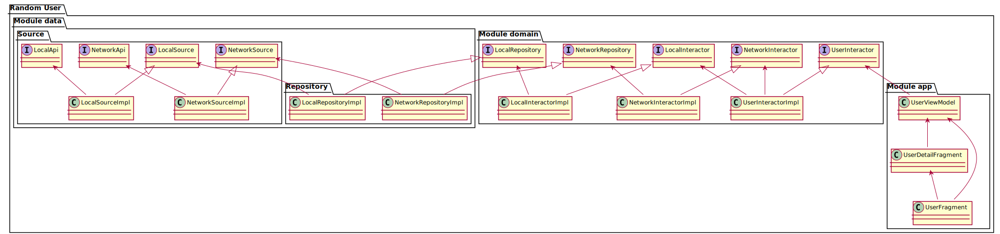

### Main Features
We have different components in this project in different modules all of them with a dependency injection (Koin):
   
   
* App Module: This module has the UI.
  
   
  * There are two fragments, UserFragment and UserDetailFragment.
  The first, observes a viewmodel, which retrieve a list of users through a stateflow that contain a state that let us have a good control of different states which can set a SUCCESS state, FAILURE or IDLE (default state) and UserFragment will respond in each case.
   
   
  When user select a user a bottom sheet dialog will be displayed with more details about user and the possibility to delete an user.
  Glide is used to display images and with an extensions function will show info like date with a correct format(local) with an image.

  * Our UserViewModel will call UserInteractor class which will retrieve a list of users and through the state will notify the new state.
   
   
  Also will respond to user actions for load more users, find an user by name or delete an user.
  Besides, is able to catch the different app exceptions.

  * UserFragment have a ConcatAdapter that has a Header Adapter with an Adapter that use a AdapterDiffCallback.
   
   
* Core Module: This module has the core classes, objects or things, shared with the rest of the app.
  
   
  * This module has the base class of the Fragments, Activities and ViewModels.
   
   
* Domain Module: This module has the interactors and repository interfaces.
  
 
  * This module has the interactors which retrieves and interact with a repositories with domain models.
  NetworkInteractor retrieve a list of user of an API.
  LocalInteractor retrieve a list of users from a local database, find by a query, save and delete users.
   
   
  UserInteractor have the logic for completed user requests as load more users from API, load users from DB or search users by given name.
   
   
* Data Module: This module has the repositories implementation, entities, or sources.
  
 
  * This module has the repositories that retrieve, find, save or delete data (users) from a source.
  A source that can use a network Api (retrofit) or a local database(room).
  Also, there are a list of custom app exceptions and a function to call network Api. This has a function that return a generic response as parameter, that inside a try/catch,will invoke a function as parameter and return the response is if successful or throw an exception.

 
 
I consider that app architecture is easy to understand when you see the code but if isn't enough, there is simple class diagram:
 
 

**Class Diagram**

 
 
Finally, there are different types of tests inside each module (Unit/Integration/UI). The most complex test are data and domain for check the correct work of business logic, room and retrofit and few unit test for the viewmodel and UI.